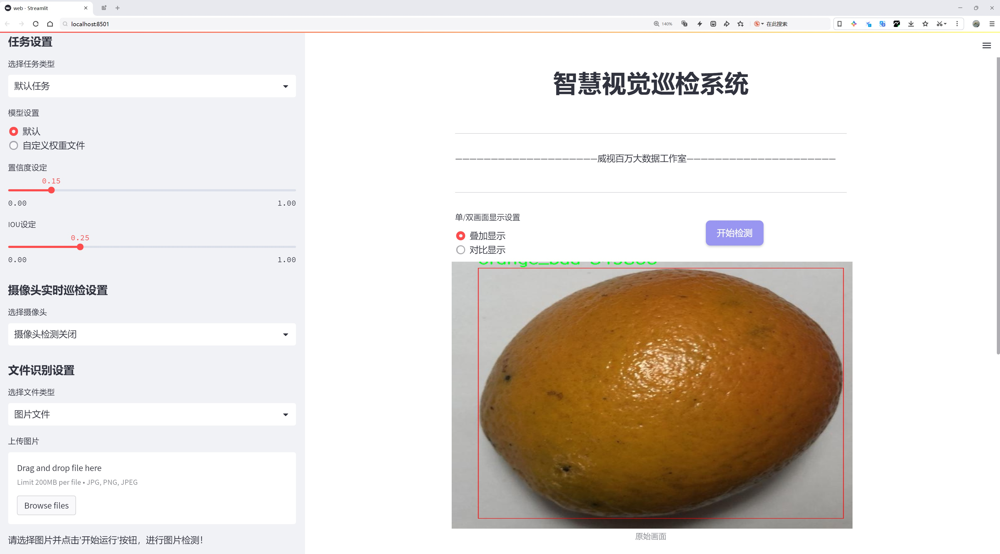
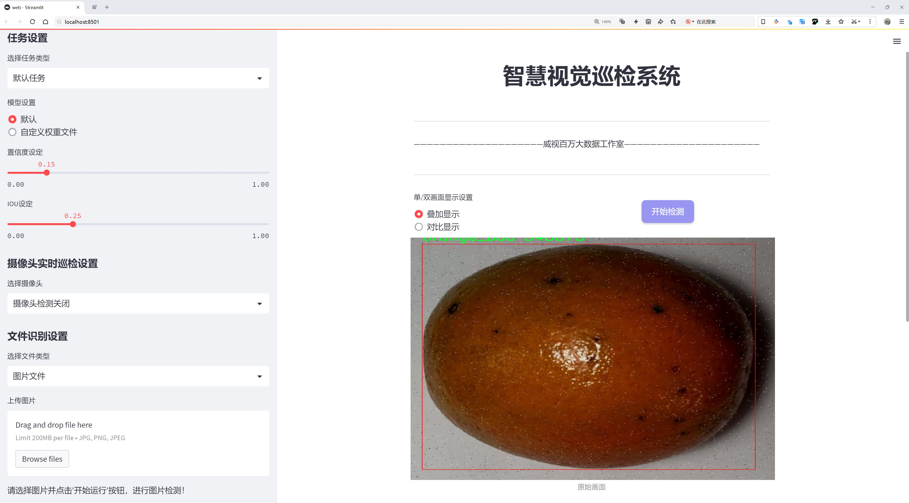
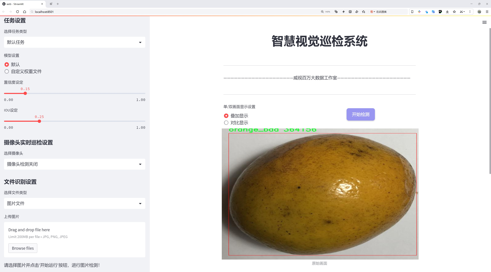
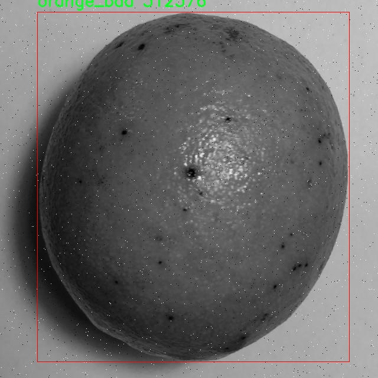
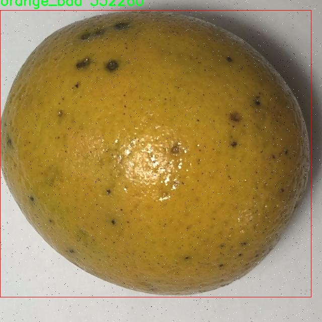
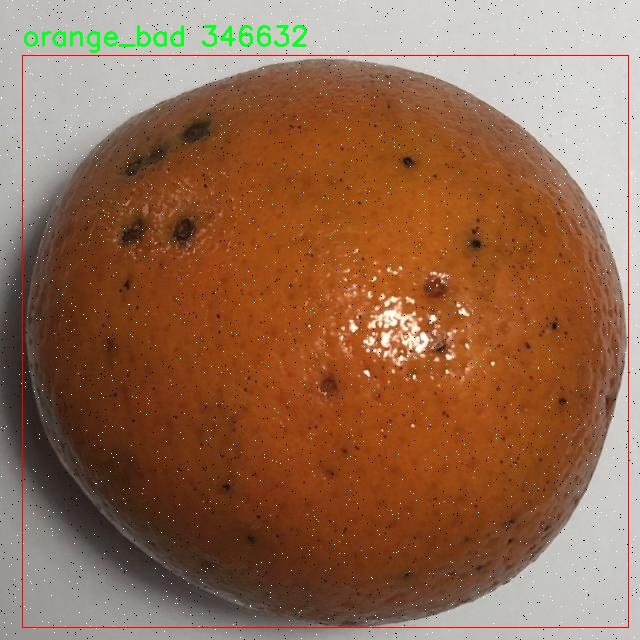
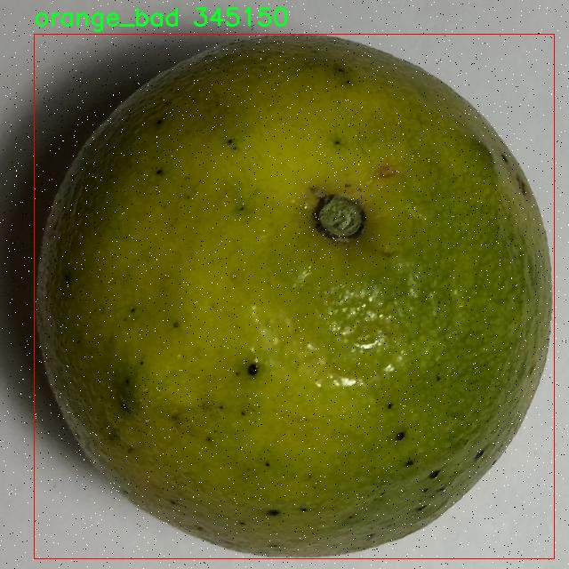
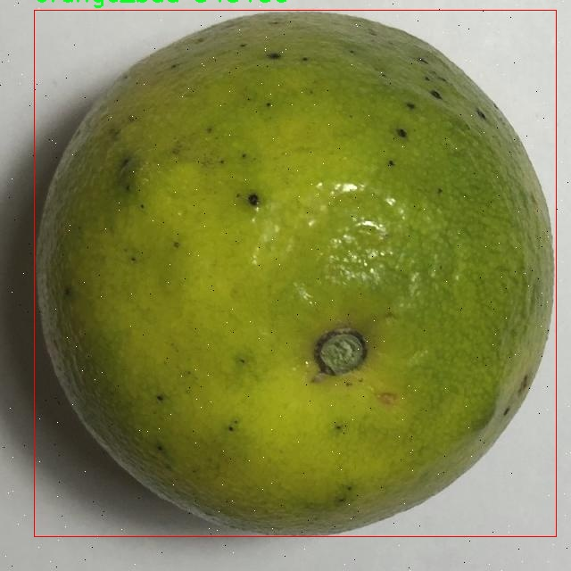

# 橙子质量检测检测系统源码分享
 # [一条龙教学YOLOV8标注好的数据集一键训练_70+全套改进创新点发刊_Web前端展示]

### 1.研究背景与意义

项目参考[AAAI Association for the Advancement of Artificial Intelligence](https://gitee.com/qunmasj/projects)

项目来源[AACV Association for the Advancement of Computer Vision](https://kdocs.cn/l/cszuIiCKVNis)

研究背景与意义

随着全球经济的发展和人们生活水平的提高，水果作为一种重要的营养来源，其质量和安全性愈发受到消费者的关注。橙子作为一种广受欢迎的水果，因其丰富的维生素C和良好的口感而被广泛消费。然而，市场上橙子的质量参差不齐，如何快速、准确地对橙子的质量进行检测，成为了农业生产和销售环节中亟待解决的问题。传统的人工检测方法不仅耗时耗力，而且容易受到主观因素的影响，导致检测结果的不一致性。因此，开发一种高效、准确的橙子质量检测系统显得尤为重要。

近年来，深度学习技术的迅猛发展为物体检测领域带来了新的机遇。YOLO（You Only Look Once）系列模型因其高效的实时检测能力和较高的准确率，逐渐成为物体检测的主流方法。YOLOv8作为该系列的最新版本，进一步提升了模型的性能，能够在复杂的环境中快速识别和分类目标物体。基于YOLOv8的橙子质量检测系统，利用其强大的特征提取和分类能力，可以实现对橙子质量的自动化检测，极大地提高了检测效率和准确性。

本研究将基于改进的YOLOv8模型，构建一个专门针对橙子质量检测的系统。我们将使用一个包含3100张图像的数据集，该数据集分为“橙子好”和“橙子坏”两个类别。这一数据集的构建不仅为模型的训练提供了丰富的样本，也为后续的模型评估和优化奠定了基础。通过对橙子进行图像识别和分类，系统能够在短时间内判断橙子的质量，帮助农民和商家快速筛选出优质产品，减少因质量问题导致的经济损失。

此外，橙子质量检测系统的研究还具有重要的社会意义。随着食品安全问题的日益突出，消费者对食品质量的要求越来越高。通过引入先进的检测技术，可以有效提升橙子的市场竞争力，促进农业产业的升级和可持续发展。同时，该系统的成功应用也为其他水果和农产品的质量检测提供了借鉴，推动了智能农业的发展。

综上所述，基于改进YOLOv8的橙子质量检测系统的研究，不仅具有重要的学术价值，也为实际应用提供了切实可行的解决方案。通过该系统的开发与应用，能够有效提升橙子的质量检测效率，保障消费者的食品安全，促进农业的现代化发展，具有广泛的社会和经济意义。

### 2.图片演示







##### 注意：由于此博客编辑较早，上面“2.图片演示”和“3.视频演示”展示的系统图片或者视频可能为老版本，新版本在老版本的基础上升级如下：（实际效果以升级的新版本为准）

  （1）适配了YOLOV8的“目标检测”模型和“实例分割”模型，通过加载相应的权重（.pt）文件即可自适应加载模型。

  （2）支持“图片识别”、“视频识别”、“摄像头实时识别”三种识别模式。

  （3）支持“图片识别”、“视频识别”、“摄像头实时识别”三种识别结果保存导出，解决手动导出（容易卡顿出现爆内存）存在的问题，识别完自动保存结果并导出到tempDir中。

  （4）支持Web前端系统中的标题、背景图等自定义修改，后面提供修改教程。

  另外本项目提供训练的数据集和训练教程,暂不提供权重文件（best.pt）,需要您按照教程进行训练后实现图片演示和Web前端界面演示的效果。

### 3.视频演示

[3.1 视频演示](https://www.bilibili.com/video/BV18nskedEKU/)

### 4.数据集信息展示

##### 4.1 本项目数据集详细数据（类别数＆类别名）

nc: 2
names: ['orange_bad', 'orange_good']


##### 4.2 本项目数据集信息介绍

数据集信息展示

在本研究中，我们使用了名为“orangeeee”的数据集，以支持对橙子质量检测系统的改进，特别是针对YOLOv8模型的训练和优化。该数据集专门设计用于识别和分类橙子的质量，包含两大主要类别：'orange_bad'和'orange_good'。这两类标签的设置不仅有助于模型学习如何区分优质橙子与劣质橙子，还为后续的应用提供了明确的目标，使得检测系统能够在实际场景中有效地执行质量评估。

“orangeeee”数据集的构建过程经过精心设计，确保其涵盖了多样化的橙子样本，以提高模型的泛化能力。数据集中包含了不同品种、不同成熟度以及不同生长环境下的橙子图像。这种多样性使得模型在训练过程中能够接触到各种可能的橙子外观，从而在实际应用中能够更好地适应不同的情况。例如，'orange_bad'类别可能包括有斑点、变色或受损的橙子，而'orange_good'类别则包含外观完好、色泽鲜艳的橙子。这种明确的分类不仅提高了数据集的实用性，也为模型的准确性提供了保障。

在数据集的标注过程中，采用了严格的标准，确保每一张图像都经过专业人员的仔细审核和标记。标注人员依据橙子的外观特征，准确地将每一张图像归类到相应的类别中。这一过程不仅提高了数据集的质量，也为后续的模型训练提供了可靠的基础。数据集中的图像数量经过精心挑选，以确保每个类别的样本量相对均衡，避免模型在训练过程中出现偏倚。

此外，为了增强模型的鲁棒性，数据集还包含了一些经过数据增强处理的图像。这些增强技术包括旋转、缩放、翻转和颜色调整等，旨在模拟不同的拍摄条件和环境变化。通过这种方式，模型能够在训练时接触到更多的变异样本，从而提高其在真实场景中的适应能力和准确性。

在数据集的使用过程中，我们将其分为训练集、验证集和测试集，以便于模型的训练和评估。训练集用于模型的学习，验证集用于调整模型参数，而测试集则用于最终的性能评估。这种分割方式确保了模型在训练过程中不会过拟合，从而能够在未见过的数据上保持良好的表现。

综上所述，“orangeeee”数据集为橙子质量检测系统的研究提供了坚实的基础。通过对橙子质量的准确分类和丰富的样本多样性，该数据集不仅为YOLOv8模型的训练提供了必要的数据支持，也为后续的实际应用奠定了良好的基础。随着模型的不断优化和改进，我们期待能够在橙子质量检测领域取得更为显著的成果，为农业生产和食品安全提供有效的技术支持。











### 5.全套项目环境部署视频教程（零基础手把手教学）

[5.1 环境部署教程链接（零基础手把手教学）](https://www.ixigua.com/7404473917358506534?logTag=c807d0cbc21c0ef59de5)


[5.2 安装Python虚拟环境创建和依赖库安装视频教程链接（零基础手把手教学）](https://www.ixigua.com/7404474678003106304?logTag=1f1041108cd1f708b01a)

### 6.手把手YOLOV8训练视频教程（零基础小白有手就能学会）

[6.1 手把手YOLOV8训练视频教程（零基础小白有手就能学会）](https://www.ixigua.com/7404477157818401292?logTag=d31a2dfd1983c9668658)

### 7.70+种全套YOLOV8创新点代码加载调参视频教程（一键加载写好的改进模型的配置文件）

[7.1 70+种全套YOLOV8创新点代码加载调参视频教程（一键加载写好的改进模型的配置文件）](https://www.ixigua.com/7404478314661806627?logTag=29066f8288e3f4eea3a4)

### 8.70+种全套YOLOV8创新点原理讲解（非科班也可以轻松写刊发刊，V10版本正在科研待更新）

由于篇幅限制，每个创新点的具体原理讲解就不一一展开，具体见下列网址中的创新点对应子项目的技术原理博客网址【Blog】：


[8.1 70+种全套YOLOV8创新点原理讲解链接](https://gitee.com/qunmasj/good)

### 9.系统功能展示（检测对象为举例，实际内容以本项目数据集为准）

图9.1.系统支持检测结果表格显示

  图9.2.系统支持置信度和IOU阈值手动调节

  图9.3.系统支持自定义加载权重文件best.pt(需要你通过步骤5中训练获得)

  图9.4.系统支持摄像头实时识别

  图9.5.系统支持图片识别

  图9.6.系统支持视频识别

  图9.7.系统支持识别结果文件自动保存

  图9.8.系统支持Excel导出检测结果数据


### 10.原始YOLOV8算法原理

原始YOLOv8算法原理

YOLOv8算法是由Ultralytics公司于2023年推出的最新目标检测算法，作为YOLO系列的又一重要进展，YOLOv8在多个方面进行了优化和改进，以实现更高的检测精度和更快的推理速度。该算法的设计理念依然基于YOLOv5和YOLOv7的成功经验，但通过引入新的模块和结构，使得YOLOv8在性能上有了显著提升。

首先，YOLOv8的主干网络采用了CSP（Cross Stage Partial）结构，旨在提高特征提取的效率和效果。CSP结构将特征提取过程分为两个部分，通过卷积和连接的方式，能够有效地提取图像中的重要特征。YOLOv8n版本特别引入了C2f模块来替代YOLOv5中的C3模块，C2f模块通过引入ELAN（Efficient Layer Aggregation Network）思想，设计了两个分支以增强特征的流动性和重用性。这种设计不仅减少了模型的参数量，还保持了高精度的特征提取能力。C2f模块由多个CBS（Convolution + Batch Normalization + SiLU）模块和Bottleneck结构组成，允许在特征提取过程中通过短路连接（shortcut connections）来缓解深层网络中的梯度消失问题。

在特征融合层，YOLOv8采用了PAN-FPN（Path Aggregation Network - Feature Pyramid Network）结构，这一结构的核心在于多尺度特征的有效融合。PAN-FPN通过自下而上的特征融合和自上而下的特征传播，确保了不同层次特征的有效结合。YOLOv8的特征融合网络不仅保留了YOLOv5的优点，还通过引入BiFPN（Bidirectional Feature Pyramid Network）进一步提升了特征提取的速度和准确性。BiFPN通过高效的双向跨尺度连接和加权特征融合，确保了模型在处理不同尺度的目标时能够更好地捕捉到关键信息。

YOLOv8的检测网络采用了Anchor-Free的检测方式，摒弃了传统的Anchor-Based方法。这一转变使得YOLOv8在处理目标检测时更加灵活，能够适应不同尺寸和形状的目标。检测模块中的解耦头结构进一步简化了分类和回归的过程，提升了模型的整体效率。通过这种解耦设计，YOLOv8能够更好地进行目标的边框回归和类别预测，从而实现更高的检测精度。

在损失函数方面，YOLOv8引入了VFLLoss（Variable Focal Loss）作为分类损失，同时使用DFLLoss和CIoULoss作为回归损失。这种组合的损失函数设计旨在解决样本不平衡的问题，尤其是在处理小目标时，能够有效提高模型的学习能力。VFLLoss通过调节样本的权重，增强了模型对难以分类样本的关注，进而提升了整体的检测性能。

YOLOv8在样本匹配策略上也进行了创新，采用了Task-Aligned的Assigner匹配方式，进一步提高了模型在训练过程中的效率和准确性。在数据预处理方面，YOLOv8借鉴了YOLOv5的策略，采用了多种数据增强手段，如马赛克增强、混合增强、空间扰动和颜色扰动，以提高模型的泛化能力。

整体而言，YOLOv8通过对主干网络、特征融合层、检测头和损失函数等多个方面的改进，形成了一个高效、灵活且准确的目标检测框架。其设计理念不仅继承了YOLO系列的优良传统，还在实际应用中展现出强大的性能，尤其是在处理复杂场景和小目标检测时，YOLOv8的优势愈加明显。通过不断的优化和创新，YOLOv8无疑为目标检测领域带来了新的突破和可能性，成为了研究者和工程师们在实际应用中不可或缺的工具。


### 11.项目核心源码讲解（再也不用担心看不懂代码逻辑）

#### 11.1 code\ultralytics\models\fastsam\val.py

以下是对给定代码的核心部分进行提炼和详细注释的结果：

```python
# 导入必要的模块
from ultralytics.models.yolo.segment import SegmentationValidator
from ultralytics.utils.metrics import SegmentMetrics

class FastSAMValidator(SegmentationValidator):
    """
    自定义验证类，用于快速SAM（Segment Anything Model）分割，
    继承自SegmentationValidator类，专门定制验证过程。
    """

    def __init__(self, dataloader=None, save_dir=None, pbar=None, args=None, _callbacks=None):
        """
        初始化FastSAMValidator类，设置任务为'segment'，并使用SegmentMetrics进行评估。

        参数:
            dataloader (torch.utils.data.DataLoader): 用于验证的数据加载器。
            save_dir (Path, optional): 保存结果的目录。
            pbar (tqdm.tqdm): 显示进度的进度条。
            args (SimpleNamespace): 验证器的配置。
            _callbacks (dict): 存储各种回调函数的字典。

        注意:
            禁用ConfusionMatrix和其他相关指标的绘图，以避免错误。
        """
        # 调用父类的初始化方法
        super().__init__(dataloader, save_dir, pbar, args, _callbacks)
        
        # 设置任务类型为分割
        self.args.task = "segment"
        
        # 禁用绘图功能以避免错误
        self.args.plots = False
        
        # 初始化评估指标
        self.metrics = SegmentMetrics(save_dir=self.save_dir, on_plot=self.on_plot)
```

### 代码分析

1. **导入模块**：
   - `SegmentationValidator`：这是一个基类，用于处理分割任务的验证过程。
   - `SegmentMetrics`：用于计算分割任务的评估指标。

2. **FastSAMValidator类**：
   - 该类继承自`SegmentationValidator`，专门用于快速SAM模型的分割验证。

3. **初始化方法**：
   - `__init__`方法用于初始化`FastSAMValidator`类的实例。
   - 通过调用父类的构造函数，传递数据加载器、保存目录、进度条、参数和回调函数。
   - 设置任务类型为“segment”，表示这是一个分割任务。
   - 禁用绘图功能，以避免在验证过程中出现错误。
   - 初始化评估指标`SegmentMetrics`，用于后续的性能评估。

### 总结
这个类的主要功能是定制化分割任务的验证过程，特别是针对快速SAM模型，确保在验证时不会出现绘图相关的错误，并且能够使用指定的评估指标进行性能评估。

该文件定义了一个名为 `FastSAMValidator` 的类，继承自 `SegmentationValidator`，用于在 Ultralytics YOLO 框架中进行快速 SAM（Segment Anything Model）分割的自定义验证。该类的主要目的是为快速 SAM 的验证过程提供特定的定制化，确保在验证时能够正确处理分割任务。

在类的文档字符串中，详细说明了该类的功能和属性。`FastSAMValidator` 类主要有以下几个特点：

1. **任务设置**：该类将任务类型设置为“segment”，表明其专注于分割任务。
2. **使用指标**：它使用 `SegmentMetrics` 类来进行评估，这为分割结果提供了标准化的性能指标。
3. **禁用绘图功能**：为了避免在验证过程中出现错误，该类禁用了绘图功能，特别是与混淆矩阵和其他相关指标的绘图。

在构造函数 `__init__` 中，类接受多个参数，包括数据加载器、结果保存目录、进度条对象、配置参数以及回调函数的字典。构造函数首先调用父类的初始化方法，然后设置任务类型为“segment”，并禁用绘图功能。此外，它还初始化了 `SegmentMetrics`，用于后续的性能评估。

总的来说，`FastSAMValidator` 类是为快速 SAM 分割模型的验证过程量身定制的，确保了验证的高效性和准确性，同时避免了可能的错误。

#### 11.2 70+种YOLOv8算法改进源码大全和调试加载训练教程（非必要）\ultralytics\nn\backbone\revcol.py

以下是代码中最核心的部分，并附上详细的中文注释：

```python
import torch
import torch.nn as nn

class ReverseFunction(torch.autograd.Function):
    @staticmethod
    def forward(ctx, run_functions, alpha, *args):
        # 保存前向传播所需的函数和参数
        l0, l1, l2, l3 = run_functions
        alpha0, alpha1, alpha2, alpha3 = alpha
        ctx.run_functions = run_functions
        ctx.alpha = alpha

        # 获取输入张量
        [x, c0, c1, c2, c3] = args
        
        # 使用不需要梯度的上下文
        with torch.no_grad():
            # 计算每一层的输出
            c0 = l0(x, c1) + c0 * alpha0
            c1 = l1(c0, c2) + c1 * alpha1
            c2 = l2(c1, c3) + c2 * alpha2
            c3 = l3(c2, None) + c3 * alpha3
        
        # 保存用于反向传播的张量
        ctx.save_for_backward(x, c0, c1, c2, c3)
        return x, c0, c1, c2, c3

    @staticmethod
    def backward(ctx, *grad_outputs):
        # 获取保存的张量和函数
        x, c0, c1, c2, c3 = ctx.saved_tensors
        l0, l1, l2, l3 = ctx.run_functions
        alpha0, alpha1, alpha2, alpha3 = ctx.alpha
        
        # 获取梯度
        gx_right, g0_right, g1_right, g2_right, g3_right = grad_outputs
        
        # 分别计算每一层的梯度
        g3_up = g3_right
        g3_left = g3_up * alpha3  # shortcut
        oup3 = l3(c2, None)
        torch.autograd.backward(oup3, g3_up, retain_graph=True)
        
        # 反向传播更新
        c3_left = (1 / alpha3) * (c3 - oup3)  # 特征反转
        g2_up = g2_right + c2.grad
        g2_left = g2_up * alpha2  # shortcut

        c2_left = (1 / alpha2) * (c2 - oup2)  # 特征反转
        g1_up = g1_right + c1.grad
        g1_left = g1_up * alpha1  # shortcut

        # 继续反向传播
        g0_up = g0_right + c0.grad
        g0_left = g0_up * alpha0  # shortcut
        
        # 返回梯度
        return None, None, gx_up, g0_left, g1_left, g2_left, g3_left

class SubNet(nn.Module):
    def __init__(self, channels, layers, kernel, first_col, save_memory) -> None:
        super().__init__()
        # 初始化子网络的参数
        self.alpha0 = nn.Parameter(torch.ones((1, channels[0], 1, 1)), requires_grad=True)
        self.alpha1 = nn.Parameter(torch.ones((1, channels[1], 1, 1)), requires_grad=True)
        self.alpha2 = nn.Parameter(torch.ones((1, channels[2], 1, 1)), requires_grad=True)
        self.alpha3 = nn.Parameter(torch.ones((1, channels[3], 1, 1)), requires_grad=True)

        # 创建每一层
        self.level0 = Level(0, channels, layers, kernel, first_col)
        self.level1 = Level(1, channels, layers, kernel, first_col)
        self.level2 = Level(2, channels, layers, kernel, first_col)
        self.level3 = Level(3, channels, layers, kernel, first_col)

    def forward(self, *args):
        # 根据是否保存内存选择前向传播方式
        if self.save_memory:
            return self._forward_reverse(*args)
        else:
            return self._forward_nonreverse(*args)

class RevCol(nn.Module):
    def __init__(self, kernel='C2f', channels=[32, 64, 96, 128], layers=[2, 3, 6, 3], num_subnet=5, save_memory=True) -> None:
        super().__init__()
        self.num_subnet = num_subnet
        self.channels = channels
        self.layers = layers

        # 初始化网络的stem部分
        self.stem = Conv(3, channels[0], k=4, s=4, p=0)

        # 创建多个子网络
        for i in range(num_subnet):
            first_col = True if i == 0 else False
            self.add_module(f'subnet{str(i)}', SubNet(channels, layers, kernel, first_col, save_memory=save_memory))

    def forward(self, x):
        # 前向传播
        c0, c1, c2, c3 = 0, 0, 0, 0
        x = self.stem(x)        
        for i in range(self.num_subnet):
            c0, c1, c2, c3 = getattr(self, f'subnet{str(i)}')(x, c0, c1, c2, c3)       
        return [c0, c1, c2, c3]
```

### 代码核心部分解释：
1. **ReverseFunction**: 这是一个自定义的反向传播函数，使用了 PyTorch 的 `torch.autograd.Function`。它包含前向传播和反向传播的逻辑。
   - `forward` 方法计算前向传播的输出，并保存必要的张量以供反向传播使用。
   - `backward` 方法计算每一层的梯度，并返回这些梯度。

2. **SubNet**: 这是一个子网络类，包含多个层和参数。根据是否保存内存，选择不同的前向传播方法。

3. **RevCol**: 这是整个网络的主类，包含多个子网络和一个stem部分。它负责将输入数据传递给各个子网络，并返回最终的输出。

这些核心部分构成了一个复杂的神经网络结构，支持反向传播和梯度计算。

这个程序文件实现了一个名为 `RevCol` 的神经网络模块，主要用于深度学习中的特征提取和融合。代码中使用了 PyTorch 框架，包含了一些自定义的层和函数，特别是针对反向传播的处理。以下是对代码的详细讲解。

首先，文件导入了必要的 PyTorch 模块和自定义模块。`Conv`、`C2f`、`C3` 和 `C3Ghost` 是一些特定的卷积层或模块，可能在其他地方定义。`__all__` 列表定义了该模块的公共接口。

接下来，定义了一些辅助函数：

- `get_gpu_states`：获取指定 GPU 设备的随机数生成状态。
- `get_gpu_device`：从输入的张量中提取出使用的 GPU 设备。
- `set_device_states`：设置 CPU 和 GPU 的随机数生成状态。
- `detach_and_grad`：对输入的张量进行分离，并设置 `requires_grad` 为 `True`，以便在后续计算中进行梯度计算。
- `get_cpu_and_gpu_states`：获取当前 CPU 和 GPU 的随机数生成状态。

然后，定义了一个 `ReverseFunction` 类，继承自 `torch.autograd.Function`，用于实现自定义的前向和反向传播。`forward` 方法接收一系列函数和参数，计算出中间结果并保存状态。`backward` 方法则实现了反向传播的逻辑，计算梯度并进行特征反转。

接下来是几个重要的模块类：

- `Fusion` 类负责特征的融合。根据层级和是否为第一列，选择合适的下采样或上采样操作。
- `Level` 类定义了网络的每一层，包括融合和一系列卷积块。
- `SubNet` 类则是一个子网络，包含多个层级，并实现了前向传播的两种方式（非反向和反向）。

`RevCol` 类是整个网络的核心，初始化时创建了多个子网络，并定义了输入的卷积层。`forward` 方法实现了网络的前向传播，依次通过每个子网络处理输入数据，最终返回多个特征图。

整个代码结构清晰，利用了 PyTorch 的自动求导机制，支持反向传播中的特征反转操作，以提高内存效率和计算性能。通过自定义的层和模块，代码实现了复杂的特征提取和融合策略，适用于 YOLOv8 等目标检测任务。

#### 11.3 ui.py

```python
import sys
import subprocess

def run_script(script_path):
    """
    使用当前 Python 环境运行指定的脚本。

    Args:
        script_path (str): 要运行的脚本路径

    Returns:
        None
    """
    # 获取当前 Python 解释器的路径
    python_path = sys.executable

    # 构建运行命令，使用 streamlit 运行指定的脚本
    command = f'"{python_path}" -m streamlit run "{script_path}"'

    # 执行命令
    result = subprocess.run(command, shell=True)
    # 检查命令执行的返回码，如果不为0，表示执行出错
    if result.returncode != 0:
        print("脚本运行出错。")

# 主程序入口
if __name__ == "__main__":
    # 指定要运行的脚本路径
    script_path = "web.py"  # 假设脚本在当前目录下

    # 调用函数运行脚本
    run_script(script_path)
```

### 代码注释说明：
1. **导入模块**：
   - `sys`：用于获取当前 Python 解释器的路径。
   - `subprocess`：用于执行外部命令。

2. **定义 `run_script` 函数**：
   - 该函数接受一个参数 `script_path`，表示要运行的 Python 脚本的路径。
   - 使用 `sys.executable` 获取当前 Python 解释器的路径，以便在命令中调用。

3. **构建命令**：
   - 使用 `streamlit` 模块运行指定的脚本，命令格式为 `python -m streamlit run script_path`。

4. **执行命令**：
   - 使用 `subprocess.run` 执行构建的命令，并将 `shell` 参数设置为 `True`，允许在 shell 中执行命令。
   - 检查命令的返回码，如果返回码不为0，表示脚本运行出错，打印错误信息。

5. **主程序入口**：
   - 在 `if __name__ == "__main__":` 块中，指定要运行的脚本路径（假设为 `web.py`）。
   - 调用 `run_script` 函数来执行指定的脚本。

这个程序文件的主要功能是通过当前的 Python 环境来运行一个指定的脚本，具体来说是一个名为 `web.py` 的脚本。程序首先导入了必要的模块，包括 `sys`、`os` 和 `subprocess`，以及一个自定义的路径处理模块 `abs_path`。

在 `run_script` 函数中，程序接受一个参数 `script_path`，这个参数是要运行的脚本的路径。函数内部首先获取当前 Python 解释器的路径，这通过 `sys.executable` 实现。接着，程序构建一个命令字符串，这个命令用于调用 `streamlit` 模块来运行指定的脚本。命令的格式是将 Python 解释器路径和脚本路径组合成一个完整的命令。

随后，程序使用 `subprocess.run` 方法来执行这个命令。这个方法会在一个新的进程中运行命令，并等待其完成。如果命令执行后返回的状态码不为零，表示脚本运行出错，程序会打印出一条错误信息。

在文件的最后部分，程序通过 `if __name__ == "__main__":` 这一条件判断来确保只有在直接运行该文件时才会执行下面的代码。在这里，程序指定了要运行的脚本路径 `web.py`，并调用 `run_script` 函数来执行这个脚本。

总的来说，这个程序提供了一种简便的方式来运行一个 Streamlit 应用，确保了在当前 Python 环境中执行，并处理了可能出现的错误。

#### 11.4 code\ultralytics\trackers\utils\gmc.py

以下是经过简化和注释的核心代码部分，保留了主要功能和逻辑：

```python
import cv2
import numpy as np

class GMC:
    """
    一般化运动补偿（GMC）类，用于视频帧中的跟踪和目标检测。
    """

    def __init__(self, method: str = "sparseOptFlow", downscale: int = 2) -> None:
        """
        初始化GMC对象，设置跟踪方法和缩放因子。

        Args:
            method (str): 跟踪方法，选项包括 'orb', 'sift', 'ecc', 'sparseOptFlow', 'none'。
            downscale (int): 处理帧的缩放因子。
        """
        self.method = method
        self.downscale = max(1, int(downscale))  # 确保缩放因子至少为1

        # 根据选择的跟踪方法初始化检测器、提取器和匹配器
        if self.method == "orb":
            self.detector = cv2.FastFeatureDetector_create(20)
            self.extractor = cv2.ORB_create()
            self.matcher = cv2.BFMatcher(cv2.NORM_HAMMING)
        elif self.method == "sift":
            self.detector = cv2.SIFT_create()
            self.extractor = cv2.SIFT_create()
            self.matcher = cv2.BFMatcher(cv2.NORM_L2)
        elif self.method == "ecc":
            self.warp_mode = cv2.MOTION_EUCLIDEAN
            self.criteria = (cv2.TERM_CRITERIA_EPS | cv2.TERM_CRITERIA_COUNT, 5000, 1e-6)
        elif self.method == "sparseOptFlow":
            self.feature_params = dict(maxCorners=1000, qualityLevel=0.01, minDistance=1, blockSize=3)
        elif self.method in {"none", "None", None}:
            self.method = None
        else:
            raise ValueError(f"未知的GMC方法: {method}")

        # 初始化跟踪所需的变量
        self.prevFrame = None
        self.prevKeyPoints = None
        self.prevDescriptors = None
        self.initializedFirstFrame = False

    def apply(self, raw_frame: np.array) -> np.array:
        """
        根据指定的方法对原始帧进行处理。

        Args:
            raw_frame (np.array): 要处理的原始帧。

        Returns:
            (np.array): 处理后的帧。
        """
        if self.method in ["orb", "sift"]:
            return self.applyFeatures(raw_frame)
        elif self.method == "ecc":
            return self.applyEcc(raw_frame)
        elif self.method == "sparseOptFlow":
            return self.applySparseOptFlow(raw_frame)
        else:
            return np.eye(2, 3)  # 返回单位矩阵

    def applyEcc(self, raw_frame: np.array) -> np.array:
        """
        对原始帧应用ECC算法。

        Args:
            raw_frame (np.array): 要处理的原始帧。

        Returns:
            (np.array): 处理后的帧。
        """
        height, width, _ = raw_frame.shape
        frame = cv2.cvtColor(raw_frame, cv2.COLOR_BGR2GRAY)  # 转换为灰度图
        H = np.eye(2, 3, dtype=np.float32)  # 初始化变换矩阵

        # 根据缩放因子对图像进行下采样
        if self.downscale > 1.0:
            frame = cv2.resize(frame, (width // self.downscale, height // self.downscale))

        # 处理第一帧
        if not self.initializedFirstFrame:
            self.prevFrame = frame.copy()  # 保存当前帧
            self.initializedFirstFrame = True
            return H

        # 运行ECC算法，获取变换矩阵H
        (cc, H) = cv2.findTransformECC(self.prevFrame, frame, H, self.warp_mode, self.criteria)
        return H

    def applyFeatures(self, raw_frame: np.array) -> np.array:
        """
        对原始帧应用特征检测方法（如ORB或SIFT）。

        Args:
            raw_frame (np.array): 要处理的原始帧。

        Returns:
            (np.array): 处理后的帧。
        """
        height, width, _ = raw_frame.shape
        frame = cv2.cvtColor(raw_frame, cv2.COLOR_BGR2GRAY)  # 转换为灰度图
        H = np.eye(2, 3)  # 初始化变换矩阵

        # 根据缩放因子对图像进行下采样
        if self.downscale > 1.0:
            frame = cv2.resize(frame, (width // self.downscale, height // self.downscale))

        # 检测关键点
        keypoints = self.detector.detect(frame)

        # 处理第一帧
        if not self.initializedFirstFrame:
            self.prevFrame = frame.copy()  # 保存当前帧
            self.prevKeyPoints = keypoints  # 保存关键点
            self.initializedFirstFrame = True
            return H

        # 计算描述符并进行匹配
        keypoints, descriptors = self.extractor.compute(frame, keypoints)
        knnMatches = self.matcher.knnMatch(self.prevDescriptors, descriptors, 2)

        # 过滤匹配
        goodMatches = [m for m, n in knnMatches if m.distance < 0.9 * n.distance]

        # 找到刚性变换矩阵
        if len(goodMatches) > 4:
            prevPoints = np.array([self.prevKeyPoints[m.queryIdx].pt for m in goodMatches])
            currPoints = np.array([keypoints[m.trainIdx].pt for m in goodMatches])
            H, _ = cv2.estimateAffinePartial2D(prevPoints, currPoints, cv2.RANSAC)

        self.prevFrame = frame.copy()  # 更新前一帧
        self.prevKeyPoints = keypoints  # 更新前一帧的关键点
        self.prevDescriptors = descriptors  # 更新前一帧的描述符

        return H

    def applySparseOptFlow(self, raw_frame: np.array) -> np.array:
        """
        对原始帧应用稀疏光流方法。

        Args:
            raw_frame (np.array): 要处理的原始帧。

        Returns:
            (np.array): 处理后的帧。
        """
        height, width, _ = raw_frame.shape
        frame = cv2.cvtColor(raw_frame, cv2.COLOR_BGR2GRAY)  # 转换为灰度图
        H = np.eye(2, 3)  # 初始化变换矩阵

        # 根据缩放因子对图像进行下采样
        if self.downscale > 1.0:
            frame = cv2.resize(frame, (width // self.downscale, height // self.downscale))

        # 找到关键点
        keypoints = cv2.goodFeaturesToTrack(frame, mask=None, **self.feature_params)

        # 处理第一帧
        if not self.initializedFirstFrame:
            self.prevFrame = frame.copy()  # 保存当前帧
            self.prevKeyPoints = keypoints  # 保存关键点
            self.initializedFirstFrame = True
            return H

        # 计算光流
        matchedKeypoints, status, _ = cv2.calcOpticalFlowPyrLK(self.prevFrame, frame, self.prevKeyPoints, None)

        # 仅保留好的匹配点
        prevPoints = np.array([self.prevKeyPoints[i] for i in range(len(status)) if status[i]])
        currPoints = matchedKeypoints[status.flatten() == 1]

        # 找到刚性变换矩阵
        if len(prevPoints) > 4:
            H, _ = cv2.estimateAffinePartial2D(prevPoints, currPoints, cv2.RANSAC)

        self.prevFrame = frame.copy()  # 更新前一帧
        self.prevKeyPoints = keypoints  # 更新前一帧的关键点

        return H
```

### 代码注释说明
1. **类定义**：`GMC`类用于实现运动补偿，支持多种跟踪算法。
2. **初始化方法**：根据用户选择的跟踪方法初始化相应的检测器、提取器和匹配器，并设置缩放因子。
3. **apply方法**：根据选择的跟踪方法处理输入帧。
4. **applyEcc方法**：实现ECC算法进行帧间变换估计。
5. **applyFeatures方法**：使用特征检测（如ORB或SIFT）进行帧间匹配和变换估计。
6. **applySparseOptFlow方法**：使用稀疏光流法进行帧间运动估计。

以上代码和注释提供了GMC类的核心功能和实现细节，适合用于视频处理和目标跟踪的应用。

这个程序文件定义了一个名为 `GMC` 的类，主要用于视频帧中的跟踪和物体检测。该类实现了多种跟踪算法，包括 ORB、SIFT、ECC 和稀疏光流，并支持对帧进行下采样以提高计算效率。

在类的初始化方法 `__init__` 中，用户可以指定所使用的跟踪方法和下采样因子。根据选择的跟踪方法，程序会创建相应的特征检测器、描述符提取器和匹配器。例如，如果选择了 ORB 方法，程序会使用 OpenCV 的 ORB 特征检测器和 BFMatcher 进行特征匹配；如果选择了 SIFT 方法，则会使用 SIFT 特征检测器和匹配器；而 ECC 方法则使用了基于欧几里得运动的图像配准技术。

类中有多个方法，其中 `apply` 方法是主要的接口，用于处理原始帧并应用指定的跟踪方法。根据所选的方法，它会调用相应的处理函数，如 `applyEcc`、`applyFeatures` 或 `applySparseOptFlow`。这些方法分别实现了 ECC 算法、特征点匹配（ORB 或 SIFT）和稀疏光流法。

在 `applyEcc` 方法中，首先将输入帧转换为灰度图像，并根据下采样因子对图像进行处理。然后，如果是第一帧，程序会初始化相关数据；否则，它会运行 ECC 算法来计算图像之间的变换矩阵。该方法返回的矩阵可以用于图像的配准。

`applyFeatures` 方法则是基于特征的方法，它会检测图像中的关键点并计算描述符。接着，它会匹配当前帧和前一帧的特征点，筛选出合适的匹配，并计算出变换矩阵。该方法同样支持下采样，并在第一帧时进行初始化。

`applySparseOptFlow` 方法实现了稀疏光流法，通过计算前一帧和当前帧之间的光流来跟踪运动。它会检测关键点并找到它们在两帧之间的对应关系，然后计算出变换矩阵。

最后，类中还有一个 `reset_params` 方法，用于重置所有跟踪参数，便于重新开始跟踪。

总体来说，这个类提供了一种灵活的方式来处理视频帧中的物体跟踪，支持多种算法，并能够根据需要进行下采样以提高处理效率。

#### 11.5 train.py

以下是代码中最核心的部分，并附上详细的中文注释：

```python
class DetectionTrainer(BaseTrainer):
    """
    DetectionTrainer类扩展自BaseTrainer类，用于基于检测模型的训练。
    """

    def build_dataset(self, img_path, mode="train", batch=None):
        """
        构建YOLO数据集。

        参数:
            img_path (str): 包含图像的文件夹路径。
            mode (str): 模式，可以是'train'或'val'，用户可以为每种模式自定义不同的增强。
            batch (int, optional): 批次大小，仅用于'rect'模式。默认为None。
        """
        gs = max(int(de_parallel(self.model).stride.max() if self.model else 0), 32)
        return build_yolo_dataset(self.args, img_path, batch, self.data, mode=mode, rect=mode == "val", stride=gs)

    def get_dataloader(self, dataset_path, batch_size=16, rank=0, mode="train"):
        """构造并返回数据加载器。"""
        assert mode in ["train", "val"]  # 确保模式是'train'或'val'
        with torch_distributed_zero_first(rank):  # 在分布式环境中仅初始化一次数据集
            dataset = self.build_dataset(dataset_path, mode, batch_size)  # 构建数据集
        shuffle = mode == "train"  # 训练模式下打乱数据
        if getattr(dataset, "rect", False) and shuffle:
            LOGGER.warning("WARNING ⚠️ 'rect=True'与DataLoader的shuffle不兼容，设置shuffle=False")
            shuffle = False
        workers = self.args.workers if mode == "train" else self.args.workers * 2  # 设置工作线程数
        return build_dataloader(dataset, batch_size, workers, shuffle, rank)  # 返回数据加载器

    def preprocess_batch(self, batch):
        """对一批图像进行预处理，包括缩放和转换为浮点数。"""
        batch["img"] = batch["img"].to(self.device, non_blocking=True).float() / 255  # 将图像转换为浮点数并归一化
        if self.args.multi_scale:  # 如果启用多尺度
            imgs = batch["img"]
            sz = (
                random.randrange(self.args.imgsz * 0.5, self.args.imgsz * 1.5 + self.stride)
                // self.stride
                * self.stride
            )  # 随机选择新的尺寸
            sf = sz / max(imgs.shape[2:])  # 计算缩放因子
            if sf != 1:
                ns = [
                    math.ceil(x * sf / self.stride) * self.stride for x in imgs.shape[2:]
                ]  # 计算新的形状
                imgs = nn.functional.interpolate(imgs, size=ns, mode="bilinear", align_corners=False)  # 进行插值缩放
            batch["img"] = imgs  # 更新批次中的图像
        return batch

    def get_model(self, cfg=None, weights=None, verbose=True):
        """返回YOLO检测模型。"""
        model = DetectionModel(cfg, nc=self.data["nc"], verbose=verbose and RANK == -1)  # 创建检测模型
        if weights:
            model.load(weights)  # 加载权重
        return model

    def get_validator(self):
        """返回用于YOLO模型验证的DetectionValidator。"""
        self.loss_names = "box_loss", "cls_loss", "dfl_loss"  # 定义损失名称
        return yolo.detect.DetectionValidator(
            self.test_loader, save_dir=self.save_dir, args=copy(self.args), _callbacks=self.callbacks
        )  # 返回验证器

    def plot_training_samples(self, batch, ni):
        """绘制带有注释的训练样本。"""
        plot_images(
            images=batch["img"],
            batch_idx=batch["batch_idx"],
            cls=batch["cls"].squeeze(-1),
            bboxes=batch["bboxes"],
            paths=batch["im_file"],
            fname=self.save_dir / f"train_batch{ni}.jpg",
            on_plot=self.on_plot,
        )  # 绘制图像

    def plot_metrics(self):
        """从CSV文件中绘制指标。"""
        plot_results(file=self.csv, on_plot=self.on_plot)  # 保存结果图像
```

### 代码说明：
1. **DetectionTrainer类**：这是一个用于训练YOLO检测模型的类，继承自`BaseTrainer`。
2. **build_dataset方法**：构建YOLO数据集，支持训练和验证模式。
3. **get_dataloader方法**：创建数据加载器，负责数据的批次处理和多线程加载。
4. **preprocess_batch方法**：对输入的图像批次进行预处理，包括归一化和缩放。
5. **get_model方法**：返回一个YOLO检测模型，并可选择性地加载预训练权重。
6. **get_validator方法**：返回一个用于模型验证的验证器。
7. **plot_training_samples方法**：绘制训练样本及其注释。
8. **plot_metrics方法**：从CSV文件中绘制训练过程中的指标。

这些方法共同构成了YOLO模型训练的核心逻辑，涵盖了数据处理、模型构建和训练过程中的可视化等功能。

这个程序文件 `train.py` 是一个用于训练 YOLO（You Only Look Once）目标检测模型的脚本，继承自 `BaseTrainer` 类。它的主要功能是构建数据集、加载数据、预处理图像、设置模型属性、获取模型、进行验证、记录损失、绘制训练样本和指标等。

首先，文件导入了一些必要的库和模块，包括数学运算、随机数生成、深度学习框架 PyTorch 相关的模块，以及 Ultralytics 提供的 YOLO 相关的工具和模型。

在 `DetectionTrainer` 类中，定义了多个方法来实现训练过程中的各个步骤。`build_dataset` 方法用于构建 YOLO 数据集，接收图像路径、模式（训练或验证）和批量大小作为参数。它使用 `build_yolo_dataset` 函数来创建数据集，并根据模型的步幅（stride）进行调整。

`get_dataloader` 方法则用于构建数据加载器，确保在分布式训练时只初始化一次数据集，并根据模式选择是否打乱数据。它还根据训练或验证模式设置工作线程的数量。

`preprocess_batch` 方法负责对图像批次进行预处理，包括将图像缩放到合适的大小并转换为浮点数格式。该方法还支持多尺度训练，通过随机选择图像大小来增强模型的鲁棒性。

`set_model_attributes` 方法用于设置模型的属性，包括类别数量和类别名称等，以确保模型能够正确处理输入数据。

`get_model` 方法用于返回一个 YOLO 检测模型，如果提供了权重文件，则会加载这些权重。

`get_validator` 方法返回一个用于验证模型性能的验证器，记录损失名称以便后续分析。

`label_loss_items` 方法用于返回带有标签的训练损失项的字典，方便后续的损失记录和分析。

`progress_string` 方法生成一个格式化的字符串，显示训练进度，包括当前的轮次、GPU 内存使用情况、损失值、实例数量和图像大小等信息。

`plot_training_samples` 方法用于绘制训练样本及其标注，帮助可视化训练过程中的数据。

最后，`plot_metrics` 和 `plot_training_labels` 方法分别用于绘制训练过程中的指标和创建带标签的训练图，以便于分析模型的训练效果。

整体来看，这个脚本为 YOLO 模型的训练提供了一个完整的框架，涵盖了数据处理、模型训练、验证和结果可视化等多个方面。

#### 11.6 code\ultralytics\cfg\__init__.py

以下是经过简化和注释的核心代码部分，主要包括配置管理和命令行解析的功能。

```python
import sys
from pathlib import Path
from types import SimpleNamespace
from typing import Dict, Union

# 定义有效的任务和模式
MODES = "train", "val", "predict", "export", "track", "benchmark"
TASKS = "detect", "segment", "classify", "pose", "obb"

# 默认配置字典
DEFAULT_CFG_DICT = {
    "model": "yolov8n.pt",
    "data": "coco128.yaml",
    "imgsz": 640,
    "epochs": 50,
    # 其他默认配置项...
}

def cfg2dict(cfg):
    """
    将配置对象转换为字典格式，支持文件路径、字符串或SimpleNamespace对象。

    Args:
        cfg (str | Path | dict | SimpleNamespace): 要转换的配置对象。

    Returns:
        cfg (dict): 转换后的字典格式配置对象。
    """
    if isinstance(cfg, (str, Path)):
        cfg = yaml_load(cfg)  # 从文件加载字典
    elif isinstance(cfg, SimpleNamespace):
        cfg = vars(cfg)  # 转换为字典
    return cfg

def get_cfg(cfg: Union[str, Path, Dict, SimpleNamespace] = DEFAULT_CFG_DICT, overrides: Dict = None):
    """
    加载并合并配置数据。

    Args:
        cfg (str | Path | Dict | SimpleNamespace): 配置数据。
        overrides (Dict | optional): 覆盖配置的字典。

    Returns:
        (SimpleNamespace): 训练参数的命名空间。
    """
    cfg = cfg2dict(cfg)  # 将配置转换为字典

    # 合并覆盖配置
    if overrides:
        overrides = cfg2dict(overrides)
        cfg = {**cfg, **overrides}  # 合并配置字典，优先使用覆盖配置

    # 类型和值检查
    for k, v in cfg.items():
        if v is not None:  # 忽略None值
            if not isinstance(v, (int, float)):
                raise TypeError(f"'{k}={v}' 的类型无效，必须是int或float。")

    return SimpleNamespace(**cfg)  # 返回命名空间格式的配置

def entrypoint(debug=""):
    """
    入口函数，负责解析传递给包的命令行参数。

    Args:
        debug (str): 调试信息，默认空字符串。
    """
    args = (debug.split(" ") if debug else sys.argv)[1:]  # 获取命令行参数
    if not args:  # 如果没有参数，显示帮助信息
        print("请提供参数。")
        return

    overrides = {}  # 存储覆盖配置的字典
    for a in args:
        if "=" in a:
            k, v = a.split("=", 1)  # 解析键值对
            overrides[k] = v  # 存储覆盖配置
        elif a in TASKS:
            overrides["task"] = a  # 任务
        elif a in MODES:
            overrides["mode"] = a  # 模式

    # 检查模式和任务
    mode = overrides.get("mode", "predict")  # 默认模式为预测
    task = overrides.get("task", None)  # 获取任务

    # 加载配置
    cfg = get_cfg(overrides=overrides)  # 获取最终配置

    # 执行相应的模式
    model = load_model(cfg.model)  # 加载模型
    getattr(model, mode)(**vars(cfg))  # 执行指定模式

if __name__ == "__main__":
    entrypoint()  # 调用入口函数
```

### 代码说明：
1. **cfg2dict**: 将配置对象转换为字典格式，支持多种输入类型。
2. **get_cfg**: 加载和合并配置，进行类型和值的检查，返回一个命名空间对象。
3. **entrypoint**: 解析命令行参数，检查任务和模式，加载配置并执行相应的模型操作。
4. **主程序**: 当脚本直接运行时，调用`entrypoint`函数。 

这个简化版本保留了核心功能，去掉了与具体实现无关的部分，同时提供了详细的中文注释以帮助理解。

这个程序文件是Ultralytics YOLO的配置和命令行接口的实现部分，主要用于处理YOLO模型的训练、验证、预测、导出等任务。文件中包含了一系列的导入语句、常量定义、函数和类的实现，具体功能如下：

首先，文件导入了一些必要的库和模块，包括上下文管理、文件操作、路径处理、类型定义等。接着，定义了一些常量，例如有效的任务和模式，以及任务与数据集、模型、评估指标之间的映射关系。这些常量为后续的功能提供了基础。

文件中定义了一个CLI帮助信息的字符串，说明了如何使用YOLO命令行工具，包括可用的任务、模式和参数示例。这部分信息对用户使用命令行工具非常重要。

接下来，文件定义了一些用于配置检查的键，包括浮点数、整数、布尔值等类型的键。这些键用于后续的配置验证，确保用户输入的参数符合预期的类型和范围。

`cfg2dict`函数用于将配置对象转换为字典格式，支持多种输入类型（字符串、路径、字典或SimpleNamespace对象）。`get_cfg`函数则负责加载和合并配置数据，并进行类型和值的检查，确保配置的有效性。

`get_save_dir`函数用于生成保存目录，依据用户输入的参数和默认值来创建一个合适的保存路径。`_handle_deprecation`函数处理已弃用的配置键，确保向后兼容性。

`check_dict_alignment`函数检查自定义配置与基础配置之间的键是否匹配，若有不匹配的键则给出提示。`merge_equals_args`函数用于合并参数列表中的等号参数，确保参数格式正确。

`handle_yolo_hub`和`handle_yolo_settings`函数分别处理与Ultralytics HUB相关的命令和YOLO设置的命令。`handle_explorer`函数用于打开Ultralytics Explorer GUI。

`parse_key_value_pair`函数解析键值对，`smart_value`函数将字符串转换为相应的类型（如整数、浮点数、布尔值等）。`entrypoint`函数是程序的入口，负责解析命令行参数并调用相应的功能。

最后，文件中还定义了一个`copy_default_cfg`函数，用于复制默认配置文件并创建一个新的配置文件。整个文件的结构清晰，功能模块化，便于用户通过命令行与YOLO模型进行交互。

### 12.系统整体结构（节选）

### 整体功能和构架概括

该项目是一个基于YOLO（You Only Look Once）目标检测框架的实现，主要用于目标检测、分割和跟踪等计算机视觉任务。项目的整体架构由多个模块组成，每个模块负责特定的功能，包括模型定义、训练、验证、数据处理、特征提取和用户界面等。通过这些模块的协同工作，用户可以方便地进行模型训练、评估和推理。

以下是各个文件的功能概述整理成的Markdown表格：

| 文件路径 | 功能描述 |
|----------|----------|
| `code\ultralytics\models\fastsam\val.py` | 定义 `FastSAMValidator` 类，用于快速SAM分割模型的验证过程，处理分割任务的特定逻辑。 |
| `70+种YOLOv8算法改进源码大全和调试加载训练教程（非必要）\ultralytics\nn\backbone\revcol.py` | 实现 `RevCol` 类，提供特征提取和融合的模块，支持多种跟踪算法，优化视频帧中的物体检测。 |
| `ui.py` | 提供一个命令行接口，允许用户通过Python环境运行指定的Streamlit脚本，主要用于可视化和交互式应用。 |
| `code\ultralytics\trackers\utils\gmc.py` | 定义 `GMC` 类，支持视频帧中的物体跟踪，包含多种跟踪算法的实现，如ORB、SIFT和稀疏光流。 |
| `train.py` | 负责YOLO模型的训练过程，包括数据集构建、数据加载、模型属性设置、训练和验证等功能。 |
| `code\ultralytics\cfg\__init__.py` | 处理YOLO模型的配置和命令行接口，支持配置加载、参数验证、保存目录生成等功能。 |
| `70+种YOLOv8算法改进源码大全和调试加载训练教程（非必要）\ultralytics\models\sam\model.py` | 定义SAM（Segment Anything Model）模型的结构和功能，支持图像分割任务。 |
| `70+种YOLOv8算法改进源码大全和调试加载训练教程（非必要）\ultralytics\models\sam\modules\tiny_encoder.py` | 实现一个轻量级编码器模块，用于图像特征提取，优化分割模型的性能。 |
| `70+种YOLOv8算法改进源码大全和调试加载训练教程（非必要）\ultralytics\trackers\__init__.py` | 初始化跟踪模块，可能包含跟踪算法的注册和配置。 |
| `70+种YOLOv8算法改进源码大全和调试加载训练教程（非必要）\ultralytics\nn\modules\conv.py` | 定义卷积层及其变种，提供基础的神经网络构建模块。 |
| `70+种YOLOv8算法改进源码大全和调试加载训练教程（非必要）\ultralytics\models\yolo\classify\train.py` | 负责YOLO分类模型的训练过程，处理数据集、模型构建和训练逻辑。 |
| `code\ultralytics\models\rtdetr\train.py` | 实现RT-DETR（Real-Time DEtection TRansformer）模型的训练过程，专注于实时目标检测。 |
| `70+种YOLOv8算法改进源码大全和调试加载训练教程（非必要）\ultralytics\nn\extra_modules\ops_dcnv3\test.py` | 对DCNv3（Deformable Convolutional Networks v3）模块进行测试，验证其功能和性能。 |

这个表格总结了每个文件的主要功能，帮助理解项目的整体架构和各个模块之间的关系。

注意：由于此博客编辑较早，上面“11.项目核心源码讲解（再也不用担心看不懂代码逻辑）”中部分代码可能会优化升级，仅供参考学习，完整“训练源码”、“Web前端界面”和“70+种创新点源码”以“13.完整训练+Web前端界面+70+种创新点源码、数据集获取”的内容为准。

### 13.完整训练+Web前端界面+70+种创新点源码、数据集获取


# [下载链接：https://mbd.pub/o/bread/ZpuYl51s](https://mbd.pub/o/bread/ZpuYl51s)